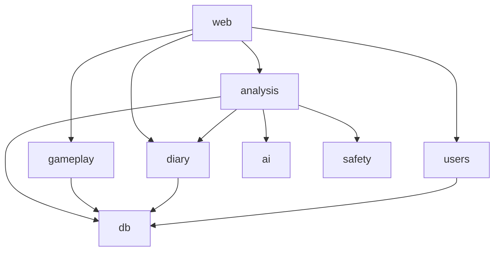

# Архитектура Kognis

> Держать актуальным вместе с кодом. Значимые решения — в [ADR](adr/).

- **Технический ответственный:** jusk-one — принимает архитектуру, ADR и существенные компромиссы.

## 1. Пользовательские сценарии
| # | Сценарий | Кто | Результат |
|---|---|---|---|
| U1 | Зарегистрироваться, войти и создать обычную запись дневника (текст, теги, эмоции); после нового подключения запись читается только владельцем | пользователь | запись сохранена и доступна только автору |
| U2 | Вечерняя оценка дня: шкалы самочувствия/настроения + рефлексия | пользователь | оценка дня, XP за рефлексию |
| U3 | Защищённая запись: «приватная» (шифрование в браузере) или «под замком» (ключ сервера + отдельный пароль) | пользователь | зашифрованная запись; ИИ — только с явного разрешения |
| U4 | ИИ-анализ периода с выбором направления психологии, уточняющие вопросы | пользователь | суммаризация, динамика, паттерны |
| U5 | Квесты, челленджи, квизы; прогресс сохраняется | пользователь | шаги квеста, XP |
| U6 | Игровая механика: опыт, уровни, streaks, достижения | пользователь | прогресс профиля |
| U7 | Простой / Advanced режим, тёмная тема | пользователь | интерфейс |

Первым сквозным путём реализуется U1 (аккаунт + запись + изоляция данных): он проверяет вход, владение данными и хранение.

## 2. Ограничения продукта
- Не медицинский сервис: дисклеймер. Кризисный детектор по умолчанию **отключён** (`KOGNIS_CRISIS_DETECTOR`, риск R4); при включении — контакты помощи и без игровой механики.
- Сейчас не делаем: оплату и тарифы, мобильное приложение, соцфункции, внешние интеграции (кроме ИИ-провайдера).
- Стек: FastAPI + PostgreSQL + React/TypeScript ([ADR 0002](adr/0002-stack-and-modules.md)).

## 3. Модули
Архитектура — **модульный монолит**, общая БД, у каждой таблицы один владелец.

Диаграмма — фактические импорты модулей (`just map`). Правила import-linter (слои; «выше» может использовать «ниже»):
`web` → `analysis | gameplay` → `diary` → `ai | safety | access` → `users` → `db`. Межмодульные эффекты (XP за запись,
квесты из анализа) связывает `web` (сценарии приложения); модули друг о друге не знают
([DECISIONS-NIGHT](DECISIONS-NIGHT.md) D2). `safety`, `ai`, `access` сейчас не зависят ни от кого; `web` вызывает
`safety` и `access` напрямую.

| Модуль | Ответственность | Владеет данными | Публичный API | Может использовать |
|---|---|---|---|---|
| [web](modules/web.md) | HTTP: JSON API, раздача интерфейса, /health, сессии; по файлу на область (`_auth`, `_diary`, `_reviews`, `_analysis`, `_progress`, `_quests`, `_quizzes`, `_settings`), общее — `_deps`, `_limits` | — | `create_app`, `main` | все модули через их API |
| [users](modules/users.md) | регистрация, вход/выход, хэш пароля (argon2id), сессии, лимит попыток входа | `users`, `sessions`, `login_attempts` | `User`, `UserService` | `db` |
| [diary](modules/diary.md) | записи (текст, теги, эмоции, режим защиты), итоги дня, выборка за период | `entries`, `day_reviews` | `DiaryService`, `Entry`, `DayReview` | `db` |
| [safety](modules/safety.md) | детектор кризисных сигналов (по умолчанию выключен), контакты помощи | — | `check_text`, `help_block` | — |
| [ai](modules/ai.md) | адаптер провайдера ИИ (фейк для тестов; OpenAI-совместимый) | — | `AiProvider`, `get_provider` | — |
| [analysis](modules/analysis.md) | ИИ-анализ периода, направления психологии, согласие, динамика настроения, память между разборами | `analyses`, `analysis_memory` | `AnalysisService` | `diary`, `ai`, `safety`, `db` |
| [gameplay](modules/gameplay.md) | XP, уровни, streaks, достижения, квесты, опросники | `xp_events`, `achievements`, `quests`, `quest_steps`, `quiz_answers`, `gameplay_settings`, `streak_recoveries` | `GameplayService`, `QuestService` | `db` |
| [access](modules/access.md) | `can_use(user, feature)` — доступ по плану (сейчас всё разрешено) | `plans` (позже) | `can_use` | — |
| [db](modules/db.md) | подключение, `metadata`, транзакции | — | `make_engine`, `transaction`, `metadata` | — |

Каркасы всех модулей и правила import-linter внесены владельцем (ADR 0002, [D1–D11](DECISIONS-NIGHT.md));
наполняются по задачам сценариев. Аутентификация и защита записей — [ADR 0003](adr/0003-auth-sessions-and-entry-protection.md),
интерфейс — [ADR 0004](adr/0004-frontend.md).

Хранение: PostgreSQL в продакшене (Docker, `deploy/compose.yml`), SQLite локально и в быстрых тестах;
схема — только миграции Alembic. Интерфейс: `frontend/` (React + TS) ходит только в `/api/*`, отдаётся `web`.

Правила (проверяются в `just verify`):
- другой модуль вызывается только через публичный API (`__init__.py`, `__all__`); `_*` — внутренности (`boundaries`);
- направление зависимостей и слои — import-linter (`arch`); циклы запрещены;
- данные изменяет только модуль-владелец; исключение — ADR с причиной, ответственным и условием пересмотра.

## 4. Владение данными
Одна таблица — один владелец. Чужие данные читаются через API владельца. «Приватные» записи хранятся как
непрозрачный шифртекст: сервер и `analysis` их не читают.
Таблицы: `users`, `sessions`, `login_attempts` — `users`; `entries`, `day_reviews` — `diary`; `analyses`, `analysis_memory` — `analysis`;
`xp_events`, `achievements`, `quests`, `quest_steps`, `quiz_answers`, `gameplay_settings`, `streak_recoveries` — `gameplay`. «Под замком» — шифртекст ключом сервера; расшифровка и
передача ИИ только по явному разрешению пользователя на конкретный анализ.

## 5. Внешние интеграции
| Система | Зачем | Протокол | Модуль-адаптер | Что если недоступна |
|---|---|---|---|---|
| DeepSeek (Ollama Cloud) | ИИ-анализ | HTTPS | `ai` | дневник работает; анализ — «попробуйте позже» |

## 6. Нефункциональные требования
Объём данных для замеров — «год работы пользователя»: 365 дней × 3 записи = **1095 записей** (килобайты каждая) и
**365 итогов дня**; целевая нагрузка — сотни пользователей, единицы запросов/с, замер — при 20 одновременных клиентах.

| Что | Требование (бюджет) | Чем проверяется |
|---|---|---|
| `GET /api/entries` (страница до 100, по умолчанию 30) | p95 ≤ 200 мс на объёме года, 20 клиентов; размер ответа ≤ 100 записей независимо от объёма дневника | приёмочные тесты kognis-3mh AC1/AC2; на staging — `just perf /api/entries --budget-ms 200` |
| `GET /api/day-reviews` (страница до 100, по умолчанию 30) | p95 ≤ 200 мс на объёме года, 20 клиентов | то же для `/api/day-reviews` |
| `GET /api/entries/labels` (варианты фильтров) | p95 ≤ 200 мс на объёме года | `just perf /api/entries/labels --budget-ms 200` |
| Доля ошибок под нагрузкой | не-2xx < 1 % | `just perf` (`MAX_ERROR_SHARE`) |
| Рост дневника | время ответа страницы не растёт с числом записей: выборка по индексу `ix_entries_owner_date_id` (владелец, дата, id), курсор (дата, id) вместо смещения | тест «страницы без пропусков и повторов»; замер на засеянном годе и на удвоенном (`--days 730`) |
| Доступность | допустим простой минуты | `/health` проверяет БД |
| RPO / RTO | RPO ≤ 24 ч (ежедневный бэкап БД, `just backup`); RTO ≤ 1 ч (`just restore` из последнего дампа) | репетиция `selftest-deploy`; сроки — RUNBOOK |

Как мерить: `just stage`, затем `python3 scripts/seed_perf.py --url …` (засев года через API; печатает cookie сеанса;
`--print-cookie` — только войти и получить cookie без засева) и `just perf <путь> --cookie … --budget-ms 200` — команды и порядок в [RUNBOOK](RUNBOOK.md). Бюджет нарушен
(`PERF FAIL`) — это дефект: задача `bd`, а не подгонка бюджета. Замер на staging делает техответственный.

- **Метрики успеха мотивации (гипотезы, [ADR 0006](adr/0006-motivation-2.md)):** D7/D30 удержание; доля дней с
  итогом дня; дни с записью за 30; доля вернувшихся в течение 7 дней после обрыва серии. Анти-метрики: «пустые»
  записи ради серии; отток сразу после обрыва. Измеряются после выпуска; порогов пока нет.
- **Безопасность:** чувствительные персональные данные; пароли — стойкий хэш (argon2/bcrypt); фильтр по владельцу в
  каждом запросе; содержимое записей не попадает в логи; секреты только через `secrets/`; сырые записи к ИИ — только с согласия.

## 7. Вероятные изменения
| Изменение | Вероятность | Как будем реализовывать | Какой модуль затронет |
|---|---|---|---|
| Тарифы и платные функции | высокая | `access.can_use(user, feature)` во всех точках; сейчас всегда «да» | access, web |
| Смена ИИ-провайдера (локальный, Claude) | высокая | адаптер `AiProvider` | ai |
| Новые направления психологии, рекомендации | высокая | промпты как данные-конфигурация | analysis |
| Новые квесты и достижения | средняя | правила как данные | gameplay |
| Смена схемы шифрования | низкая | версия формата в поле записи | diary |
| Рост дневника (годы записей) | средняя | списки — страницами по курсору (`DiaryService.list_entries` / `list_day_reviews`), отбор по периоду и меткам в SQL, индекс `(owner_id, entry_date, id)` (миграция 0013); бюджеты — раздел 6 | diary, web, analysis |
| Новая область API | средняя | отдельный файл роутера в `web/`, сборка в `_app.py`; файл ≤ 400 строк (тест kognis-pj6 AC1) | web |

## 8. Неизвестные и рискованные предположения
| # | Предположение | Риск, если неверно | Проверка: эксперимент / задача | Результат |
|---|---|---|---|---|
| R1 | Пользователь A не может прочитать записи B ни по какому пути запроса | утечка чувствительных данных | приёмочный тест U1 (AC2), проверка изоляции | закрыт тестом AC2: чужая запись → 404 по API и не видна в интерфейсе |
| R2 | Шифрование в браузере (PBKDF2/Argon2 + AES-GCM, WebCrypto) работает на целевых браузерах | режим «приватная» непригоден | отдельная задача bd (spike WebCrypto) | вынесен из kognis-b8z. Частично подтверждено: приватные записи работают в Chromium (e2e `tests/e2e/test_ui.py`); Firefox и WebKit не проверены — kognis-2e0 |
| R3 | Качество ИИ-анализа DeepSeek достаточно, латентность и стоимость приемлемы | продукт малоценен | kognis-3fl: набор примеров `evals/ai/cases/` и `scripts/ai_eval.py --provider env` (см. `evals/ai/README.md`) | набор и проверки готовы. Реальный прогон (2026-09-29, DeepSeek deepseek-v4.1-flash через Ollama Cloud, направление cbt, 11 примеров): 13/60 проверок (22 %), время ответа ≈ 26 с. **Опровергнуто в текущем виде:** формат ответа модели не совпадает со схемой (поле паттерна `pattern` вместо `title`, лишние поля при `extra="forbid"`); по содержанию ответы хорошие. Исправление — отдельная задача kognis-149 (промпт с точной структурой ответа). **После kognis-149 (2026-09-30, все 5 направлений, 11 примеров): 291/300 (97 %), `json_schema` 100 %, ответ 4–11 с — подтверждено.** Все 9 провалов — `grounding`: цитаты из рефлексии итога дня (8) и тег эмоции (1), т. е. реальный текст пользователя; проверка сверяет только с записями — уточнение проверки в задаче отключения детектора. Оговорка: при провале `json_schema` остальные проверки автоматически считаются проваленными, поэтому 22 % занижает оценку содержания |
| R4 | Кризисный детектор отключён (`KOGNIS_CRISIS_DETECTOR=off`, решение владельца 2026-09-30): фразы и контакты зависят от языка и страны, продукт станет мультиязычным (ru/en/es/fr) | человек в кризисе не получит блок помощи, запись не будет помечена; частичная страховка — инструкция в промпте анализа (`src/kognis/analysis/_prompts_i18n.py::SAFETY_CLAUSE`), она не заменяет детектор | kognis-fvn: включить детектор по языкам (фразы + контакты по странам, проверка носителем и юристом) | открыт; до закрытия kognis-fvn лендинг и интерфейс не обещают распознавания кризиса |

## Данные и контракты
Форматы, схемы, внешние API — в [contracts](contracts/README.md).

## Качество
Проверки: `just verify` (формат, линтер, типы strict, тесты с покрытием ≥ 80 %, запрет ослабления, секреты, ссылки).
