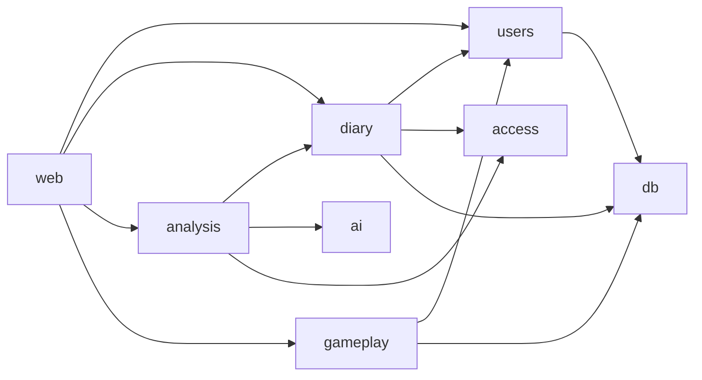

# Архитектура Kognis

> Держать актуальным вместе с кодом. Значимые решения — в [ADR](adr/).

- **Технический ответственный:** jusk-one — принимает архитектуру, ADR и существенные компромиссы.

## 1. Пользовательские сценарии
| # | Сценарий | Кто | Результат |
|---|---|---|---|
| U1 | Зарегистрироваться, войти и создать обычную запись дневника (текст, теги, эмоции); после нового подключения запись читается только владельцем | пользователь | запись сохранена и доступна только автору |
| U2 | Вечерняя оценка дня: шкалы самочувствия/настроения + рефлексия | пользователь | оценка дня, XP за рефлексию |
| U3 | Защищённая запись: «приватная» (шифрование в браузере) или «под замком» (ключ сервера + отдельный пароль) | пользователь | зашифрованная запись; ИИ — только с явного разрешения |
| U4 | ИИ-анализ периода с выбором направления психологии, уточняющие вопросы | пользователь | суммаризация, динамика, паттерны |
| U5 | Квесты, челленджи, квизы; прогресс сохраняется | пользователь | шаги квеста, XP |
| U6 | Игровая механика: опыт, уровни, streaks, достижения | пользователь | прогресс профиля |
| U7 | Простой / Advanced режим, тёмная тема | пользователь | интерфейс |

Первым сквозным путём реализуется U1 (аккаунт + запись + изоляция данных): он проверяет вход, владение данными и хранение.

## 2. Ограничения продукта
- Не медицинский сервис: дисклеймер; при признаках кризиса — контакты помощи, без игровой механики.
- Сейчас не делаем: оплату и тарифы, мобильное приложение, соцфункции, внешние интеграции (кроме ИИ-провайдера).
- Стек: FastAPI + PostgreSQL + React/TypeScript ([ADR 0002](adr/0002-stack-and-modules.md)).

## 3. Модули
Архитектура — **модульный монолит**, общая БД, у каждой таблицы один владелец.

| Модуль | Ответственность | Владеет данными | Публичный API | Может использовать |
|---|---|---|---|---|
| [web](modules/web.md) | HTTP: JSON API, раздача интерфейса, /health, сессии | — | `create_app`, `main` | все модули через их API |
| [users](modules/users.md) | регистрация, вход, хэш пароля, сессии | `users`, сессии | `User`, `UserService` | `db` |
| diary (план, U1) | записи, теги, эмоции, оценка дня, режим защиты (шифртекст) | `entries`, `day_reviews` | `DiaryService` | `users`, `access`, `db` |
| analysis (план, U4) | ИИ-анализ периода, направления психологии, уточняющие вопросы, проверка согласия | `analyses` | `AnalysisService` | `diary`, `ai`, `access` |
| ai (план, U4) | адаптер провайдера ИИ (DeepSeek/Ollama Cloud, фейк для тестов, позже локальный/Claude) | — | `AiProvider` | — |
| gameplay (план, U5–U6) | XP, уровни, streaks, достижения, квесты/челленджи/квизы | `progress`, `quests` | `GameplayService` | `users`, `db` |
| access (план) | проверка доступа к функциям по плану (сейчас всё разрешено) | `plans` (позже) | `can_use(user, feature)` | `users` |
| [db](modules/db.md) | подключение, `metadata`, транзакции | — | `make_engine`, `transaction`, `metadata` | — |

Планируемые модули создаются по мере сценариев (`just module-new`) вместе с правилами import-linter — это решение
человека, фиксируется в ADR 0002.

Хранение: PostgreSQL в продакшене (Docker, `deploy/compose.yml`), SQLite локально и в быстрых тестах;
схема — только миграции Alembic. Интерфейс: `frontend/` (React + TS) ходит только в `/api/*`, отдаётся `web`.

Правила (проверяются в `just verify`):
- другой модуль вызывается только через публичный API (`__init__.py`, `__all__`); `_*` — внутренности (`boundaries`);
- направление зависимостей и слои — import-linter (`arch`); циклы запрещены;
- данные изменяет только модуль-владелец; исключение — ADR с причиной, ответственным и условием пересмотра.

## 4. Владение данными
Одна таблица — один владелец. Чужие данные читаются через API владельца. «Приватные» записи хранятся как
непрозрачный шифртекст: сервер и `analysis` их не читают. «Под замком» — шифртекст ключом сервера; расшифровка и
передача ИИ только по явному разрешению пользователя на конкретный анализ.

## 5. Внешние интеграции
| Система | Зачем | Протокол | Модуль-адаптер | Что если недоступна |
|---|---|---|---|---|
| DeepSeek (Ollama Cloud) | ИИ-анализ | HTTPS | `ai` | дневник работает; анализ — «попробуйте позже» |

## 6. Нефункциональные требования
- **Нагрузка:** старт — сотни пользователей, единицы запросов/с; записи — килобайты.
- **Доступность:** допустим простой минуты; RPO ≤ 24 ч (ежедневный бэкап БД).
- **Безопасность:** чувствительные персональные данные; пароли — стойкий хэш (argon2/bcrypt); фильтр по владельцу в
  каждом запросе; содержимое записей не попадает в логи; секреты только через `secrets/`; сырые записи к ИИ — только с согласия.

## 7. Вероятные изменения
| Изменение | Вероятность | Как будем реализовывать | Какой модуль затронет |
|---|---|---|---|
| Тарифы и платные функции | высокая | `access.can_use(user, feature)` во всех точках; сейчас всегда «да» | access, web |
| Смена ИИ-провайдера (локальный, Claude) | высокая | адаптер `AiProvider` | ai |
| Новые направления психологии, рекомендации | высокая | промпты как данные-конфигурация | analysis |
| Новые квесты и достижения | средняя | правила как данные | gameplay |
| Смена схемы шифрования | низкая | версия формата в поле записи | diary |

## 8. Неизвестные и рискованные предположения
| # | Предположение | Риск, если неверно | Проверка: эксперимент / задача | Результат |
|---|---|---|---|---|
| R1 | Пользователь A не может прочитать записи B ни по какому пути запроса | утечка чувствительных данных | приёмочный тест U1 (AC2), проверка изоляции | — |
| R2 | Шифрование в браузере (PBKDF2/Argon2 + AES-GCM, WebCrypto) работает на целевых браузерах | режим «приватная» непригоден | отдельная задача (spike) после U1 | — |
| R3 | Качество ИИ-анализа DeepSeek достаточно, латентность и стоимость приемлемы | продукт малоценен | отдельная задача (spike с реальным провайдером) | — |

## Данные и контракты
Форматы, схемы, внешние API — в [contracts](contracts/README.md).

## Качество
Проверки: `just verify` (формат, линтер, типы strict, тесты с покрытием ≥ 80 %, запрет ослабления, секреты, ссылки).
