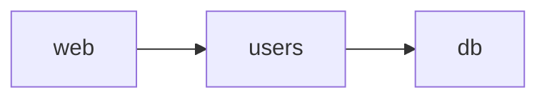

# Архитектура Kognis

> Держать актуальным вместе с кодом. Значимые решения — в [ADR](adr/).

- **Технический ответственный:** jusk-one — принимает архитектуру, ADR и существенные компромиссы.

## 1. Пользовательские сценарии
Ключевые сценарии (3–7), ради которых существует система. Первый — реализуется сквозным сценарием до расширения.

| # | Сценарий | Кто | Результат |
|---|---|---|---|
| U1 | Зарегистрировать пользователя и поприветствовать его | клиент API | приветствие с именем (пример) |

## 2. Ограничения продукта
Сроки, бюджет, окружение, регуляторика, что точно не делаем.

## 3. Модули
Исходная архитектура — **модульный монолит**: одно приложение, модули по бизнес-областям, общая БД допустима.
Иное (сервисы, отдельные БД) — только через ADR с обоснованием требованиями проекта.

| Модуль | Ответственность | Владеет данными | Публичный API | Может использовать |
|---|---|---|---|---|
| [web](modules/web.md) | HTTP: JSON API, раздача интерфейса `frontend/`, /health | — | `create_app`, `main` | `users`, `db` |
| [users](modules/users.md) | регистрация и поиск пользователей | таблица `users` | `User`, `UserService` | `db` |
| [db](modules/db.md) | подключение, `metadata`, транзакции | — | `make_engine`, `transaction`, `metadata` | — |

Хранение: PostgreSQL в продакшене (Docker, `deploy/compose.yml`), SQLite локально и в быстрых тестах;
схема — только миграции Alembic (`migrations/`, проверка `migrations` в verify).
Интерфейс: `frontend/` — React + TypeScript (Vite), ходит только в `/api/*`; собранный `frontend/dist`
отдаёт `web` (один порт и один образ). Проверка `frontend` в verify: Biome, tsc strict, vitest, сборка.

Правила (проверяются в `just verify`):
- другой модуль вызывается только через его публичный API (`__init__.py`, `__all__`); `_*` — внутренности (`boundaries`);
- направление зависимостей и слои внутри модуля — `.importlinter` (`arch`); циклы запрещены;
- данные изменяет только модуль-владелец; исключение — ADR с причиной, ответственным и условием пересмотра;
- новый модуль: `just module-new <имя>` → правило в `.importlinter` (решение человека + ADR) → строка здесь.

## 4. Владение данными
Каждая сущность / таблица имеет одного модуля-владельца (см. таблицу выше и карточки `docs/modules/`).
Чтение чужих данных — через публичный API владельца; прямые запросы к таблицам соседа — только как исключение (ADR).

## 5. Внешние интеграции
| Система | Зачем | Протокол | Модуль-адаптер | Что если недоступна |
|---|---|---|---|---|

## 6. Нефункциональные требования
- **Нагрузка:** пользователей, запросов/с, объём данных.
- **Доступность:** допустимый простой, RPO/RTO.
- **Безопасность:** персональные данные, роли, аудит, секреты.

## 7. Вероятные изменения (3–5)
| Изменение | Вероятность | Как будем реализовывать | Какой модуль затронет |
|---|---|---|---|

## 8. Неизвестные и рискованные предположения
| # | Предположение | Риск, если неверно | Проверка: эксперимент / задача | Результат |
|---|---|---|---|---|

## Данные и контракты
Форматы, схемы, внешние API — в [contracts](contracts/README.md).

## Качество
Проверки: `just verify` (формат, линтер, типы strict, тесты с покрытием ≥ 80 %, запрет ослабления, секреты, ссылки).
